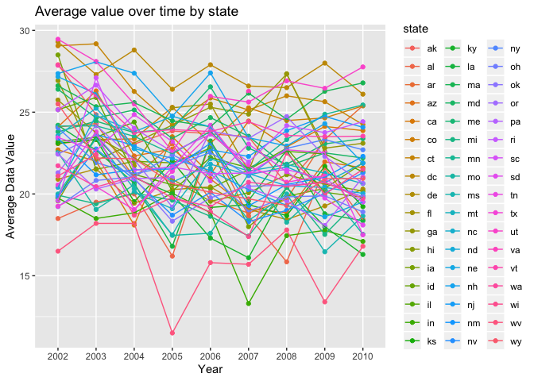
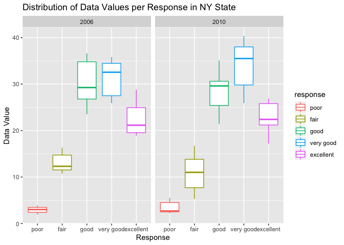
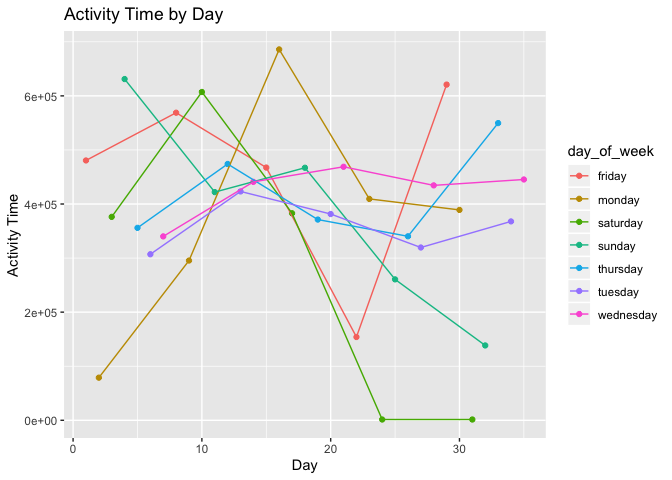

homework3\_cq2207
================
Carolina Q Cardoso
10/9/2019

``` r
library(tidyverse)
```

    ## ── Attaching packages ──────────────────────────────────────────────────────────── tidyverse 1.2.1 ──

    ## ✔ ggplot2 3.2.1     ✔ purrr   0.3.2
    ## ✔ tibble  2.1.3     ✔ dplyr   0.8.3
    ## ✔ tidyr   1.0.0     ✔ stringr 1.4.0
    ## ✔ readr   1.3.1     ✔ forcats 0.4.0

    ## ── Conflicts ─────────────────────────────────────────────────────────────── tidyverse_conflicts() ──
    ## ✖ dplyr::filter() masks stats::filter()
    ## ✖ dplyr::lag()    masks stats::lag()

``` r
library(dplyr)
library(ggplot2)

library(p8105.datasets)
data("instacart")
```

The dataset `Instacart` contains 1384617 observations and 15 variables.
Variables describe details of the order and of the products
ordered.

``` r
#How many aisles are there, and which aisles are the most items ordered from?

aisle_count = instacart %>%
  group_by(aisle_id, aisle) %>%
  summarize(count = n()) %>%
  arrange(desc(count))
```

There are 134 different aisles. The aisle with the highest number of
ordered items in “fresh vegetables” with 150609 items, followed by
“fresh fruits” with 150473 ordered
items.

``` r
#Make a plot that shows the number of items ordered in each aisle, limiting this to aisles with more than 10000 items ordered. Arrange aisles sensibly, and organize your plot so others can read it.

library(ggplot2)

aisle_count %>%
  filter(count > 10000) %>%
  ggplot(aes(x = aisle_id, y = count)) + 
    geom_point() + geom_line() + 
    labs(
    title = "Number of Items Ordered by Aisle (n > 10000)",
    x = "Aisle",
    y = "Total Number of Items Ordered")
```

<!-- -->

``` r
#Make a table showing the three most popular items in each of the aisles “baking ingredients”, “dog food care”, and “packaged vegetables fruits”. Include the number of times each item is ordered in your table.

library(knitr)

product_count = instacart %>%
  group_by(aisle, product_name) %>%
  summarize (count = n()) %>%
  filter(aisle == "baking ingredients" | aisle == "dog food care" | aisle == "packaged vegetables fruits") %>%
  mutate (rank = min_rank(desc(count))) %>%
  filter (rank <= 3) %>%
  select(-rank) %>% 
  knitr::kable() %>% 
    print()
```

    ## 
    ## 
    ## aisle                        product_name                                     count
    ## ---------------------------  ----------------------------------------------  ------
    ## baking ingredients           Cane Sugar                                         336
    ## baking ingredients           Light Brown Sugar                                  499
    ## baking ingredients           Pure Baking Soda                                   387
    ## dog food care                Organix Chicken & Brown Rice Recipe                 28
    ## dog food care                Small Dog Biscuits                                  26
    ## dog food care                Snack Sticks Chicken & Rice Recipe Dog Treats       30
    ## packaged vegetables fruits   Organic Baby Spinach                              9784
    ## packaged vegetables fruits   Organic Blueberries                               4966
    ## packaged vegetables fruits   Organic Raspberries                               5546

``` r
#Make a table showing the mean hour of the day at which Pink Lady Apples and Coffee Ice Cream are ordered on each day of the week; format this table for human readers (i.e. produce a 2 x 7 table)
  

library(tidyverse)
library(tidyr)

apple_coffee = instacart %>% 
  group_by (product_name, order_dow) %>%
  summarize(mean_hour = mean(order_hour_of_day)) %>%
  filter(product_name == "Pink Lady Apples" | product_name == "Coffee Ice Cream")%>%
  pivot_wider(names_from = order_dow, values_from = mean_hour) %>%
  knitr::kable(col.names = c("Product", "Sun", "Mon", "Tue", "Wed", "Thu", "Fri", "Sat")) %>% 
    print()
```

    ## 
    ## 
    ## Product                  Sun        Mon        Tue        Wed        Thu        Fri        Sat
    ## -----------------  ---------  ---------  ---------  ---------  ---------  ---------  ---------
    ## Coffee Ice Cream    13.77419   14.31579   15.38095   15.31818   15.21739   12.26316   13.83333
    ## Pink Lady Apples    13.44118   11.36000   11.70213   14.25000   11.55172   12.78431   11.93750

``` r
data("brfss_smart2010")

brfss_new = brfss_smart2010 %>% 
    janitor::clean_names() %>%
    mutate_all(tolower) %>%
    filter (topic == "overall health") %>%
    rename(`state` = locationabbr, `county` = locationdesc, `coordinates` = geo_location) %>%
    mutate(response = factor(response, labels = c("poor","fair","good","very good","excellent")))
  
brfss_new 
```

    ## # A tibble: 10,625 x 23
    ##    year  state county class topic question response sample_size data_value
    ##    <chr> <chr> <chr>  <chr> <chr> <chr>    <fct>    <chr>       <chr>     
    ##  1 2010  al    al - … heal… over… how is … poor     94          18.9      
    ##  2 2010  al    al - … heal… over… how is … excelle… 148         30        
    ##  3 2010  al    al - … heal… over… how is … good     208         33.1      
    ##  4 2010  al    al - … heal… over… how is … fair     107         12.5      
    ##  5 2010  al    al - … heal… over… how is … very go… 45          5.5       
    ##  6 2010  al    al - … heal… over… how is … poor     91          15.6      
    ##  7 2010  al    al - … heal… over… how is … excelle… 177         31.3      
    ##  8 2010  al    al - … heal… over… how is … good     224         31.2      
    ##  9 2010  al    al - … heal… over… how is … fair     120         15.5      
    ## 10 2010  al    al - … heal… over… how is … very go… 66          6.4       
    ## # … with 10,615 more rows, and 14 more variables:
    ## #   confidence_limit_low <chr>, confidence_limit_high <chr>,
    ## #   display_order <chr>, data_value_unit <chr>, data_value_type <chr>,
    ## #   data_value_footnote_symbol <chr>, data_value_footnote <chr>,
    ## #   data_source <chr>, class_id <chr>, topic_id <chr>, location_id <chr>,
    ## #   question_id <chr>, respid <chr>, coordinates <chr>

``` r
 #In 2002, which states were observed at 7 or more locations? What about in 2010?

brfss_2002 = brfss_new %>%
    group_by(year, state) %>%
    summarize(n = n_distinct(coordinates)) %>%
    filter (n > 6, year == '2002')

brfss_2010 = brfss_new %>%
    group_by(year, state) %>%
    summarize(n = n_distinct(coordinates)) %>%
    filter (n > 6, year == '2010')
```

In 2002, there were 6 states that were observed in 7 or more locations:
ct, fl, ma, nc, nj, and pa. In 2010, there were 14 states that were
observed in 7 or more locations: ca, co, fl, ma, md, nc, ne, nj, ny, oh,
pa, sc, tx, and
wa.

``` r
#Construct a dataset that is limited to Excellent responses, and contains, year, state, and a variable that averages the data_value across locations within a state. Make a “spaghetti” plot of this average value over time within a state (that is, make a plot showing a line for each state across years – the geom_line geometry and group aesthetic will help).

brfss_excellent = brfss_new %>%
  transform(data_value = as.numeric(data_value))%>%
    filter (response == 'excellent') %>%
    group_by(state, year, response) %>%
    summarize(mean_data = mean(data_value))

brfss_excellent %>% 
    ggplot(aes(x = year, y = mean_data, group = state, color = state)) + 
    geom_point() + geom_line() +
    labs(
    title = "Average value over time by state",
    x = "Year",
    y = "Average Data Value"
  )
```

    ## Warning: Removed 6 rows containing missing values (geom_point).

    ## Warning: Removed 2 rows containing missing values (geom_path).

<!-- -->

``` r
#Make a two-panel plot showing, for the years 2006, and 2010, distribution of data_value for responses (“Poor” to “Excellent”) among locations in NY State.

brfss_two = brfss_new %>%
    transform(data_value = as.numeric(data_value)) %>%
    filter(state == 'ny',year == '2006' | year == '2010') %>%
    select(state, year, response, data_value)

brfss_two %>%
    ggplot(aes(x = response, y = data_value, color = response)) + 
    geom_boxplot() + 
    facet_grid(. ~ year) + 
    labs(
    title = "Distribution of Data Values per Response in NY State",
    x = "Response",
    y = "Data Value")
```

<!-- -->

``` r
#Load, tidy, and otherwise wrangle the data. Your final dataset should include all originally observed variables and values; have useful variable names; include a weekday vs weekend variable; and encode data with reasonable variable classes. Describe the resulting dataset (e.g. what variables exist, how many observations, etc).

accel_data = read_csv("./data/accel_data.csv") 
```

    ## Parsed with column specification:
    ## cols(
    ##   .default = col_double(),
    ##   day = col_character()
    ## )

    ## See spec(...) for full column specifications.

``` r
accel_new = accel_data %>%
    janitor::clean_names() %>%
    mutate_all(tolower) %>%
    rename (`day_of_week` = day) %>%
    mutate(day_of_week = factor(day_of_week, labels = c("mon","tues","wed","thurs","fri", "sat", "sun"))) %>%
    mutate(weekend = if_else(day_of_week=="sun" | day_of_week == 'sat', "weekend", "weekday")) %>%
    select(week, day_id, day_of_week, weekend, everything())
```

The dataset `accel_new` has 35 observations and 1444 variables.
Variables include the `week` and `day_of_week` when the accelerometer
data was collected. The variable `weekend` indicates whether the day the
data was collected was a weekend or not. The variable activity\_x, from
`activity_1` to `activity_1440` represent the activity count for each
minute of the day, starting at midnight. The dataset shows that this
patient wearing the accelerometer used it for 5 weeks and 35
days.

``` r
#Traditional analyses of accelerometer data focus on the total activity over the day. Using your tidied dataset, aggregate accross minutes to create a total activity variable for each day, and create a table showing these totals. Are any trends apparent?

accel_total_activity = accel_new %>%
  pivot_longer(activity_1:activity_1440, names_to = "minute", values_to = "activity_min") %>%
  separate(minute, into = c(NA, "minute"), sep = "activity_") %>%
  mutate(activity_min = as.numeric(activity_min),minute = as.numeric(minute), day_id = as.numeric(day_id)) %>%
  group_by(day_id, day_of_week) %>%
  summarize(activity_day = sum(activity_min)) %>%
  arrange(day_id) 

accel_total_activity %>% knitr::kable() %>% 
    print()
```

    ## 
    ## 
    ##  day_id  day_of_week    activity_day
    ## -------  ------------  -------------
    ##       1  mon               480542.62
    ##       2  tues               78828.07
    ##       3  wed               376254.00
    ##       4  thurs             631105.00
    ##       5  fri               355923.64
    ##       6  sat               307094.24
    ##       7  sun               340115.01
    ##       8  mon               568839.00
    ##       9  tues              295431.00
    ##      10  wed               607175.00
    ##      11  thurs             422018.00
    ##      12  fri               474048.00
    ##      13  sat               423245.00
    ##      14  sun               440962.00
    ##      15  mon               467420.00
    ##      16  tues              685910.00
    ##      17  wed               382928.00
    ##      18  thurs             467052.00
    ##      19  fri               371230.00
    ##      20  sat               381507.00
    ##      21  sun               468869.00
    ##      22  mon               154049.00
    ##      23  tues              409450.00
    ##      24  wed                 1440.00
    ##      25  thurs             260617.00
    ##      26  fri               340291.00
    ##      27  sat               319568.00
    ##      28  sun               434460.00
    ##      29  mon               620860.00
    ##      30  tues              389080.00
    ##      31  wed                 1440.00
    ##      32  thurs             138421.00
    ##      33  fri               549658.00
    ##      34  sat               367824.00
    ##      35  sun               445366.00

Based on the table, there are no apparent trends in the activity level
of the patient per
day.

``` r
#Accelerometer data allows the inspection activity over the course of the day. Make a single-panel plot that shows the 24-hour activity time courses for each day and use color to indicate day of the week. Describe in words any patterns or conclusions you can make based on this graph.

accel_total_activity %>%
    ggplot(aes(x = day_id, y = activity_day, color = day_of_week)) + 
    geom_point() + geom_line() +
    labs(
    title = "Activity Time by Day",
    x = "Day",
    y = "Activity Time")
```

<!-- -->

The graph shows that the patient’s weekend activity stayed somewhat
stable and moderate throught out the entire testing period. The activity
level varies by weekday, showing no apparent trends.
